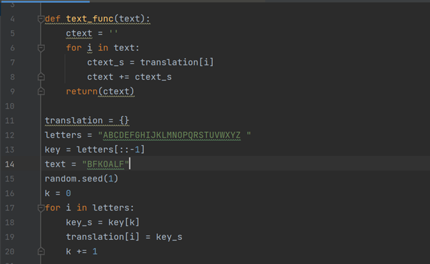

---
# Front matter
lang: ru-RU
title: "Лабораторная работа №1"
subtitle: "Математические основы защиты информации и информационной безопасности"
author: "Колчева Юлия Вячеславовна"

# Formatting
toc-title: "Содержание"
toc: true # Table of contents
toc_depth: 2
lof: true # List of figures
lot: true # List of tables
fontsize: 12pt
linestretch: 1.5
papersize: a4paper
documentclass: scrreprt
polyglossia-lang: russian
polyglossia-otherlangs: english
mainfont: PT Serif
romanfont: PT Serif
sansfont: PT Sans
monofont: PT Mono
mainfontoptions: Ligatures=TeX
romanfontoptions: Ligatures=TeX
sansfontoptions: Ligatures=TeX,Scale=MatchLowercase
monofontoptions: Scale=MatchLowercase
indent: true
pdf-engine: lualatex
header-includes:
  - \linepenalty=10 # the penalty added to the badness of each line within a paragraph (no associated penalty node) Increasing the value makes tex try to have fewer lines in the paragraph.
  - \interlinepenalty=0 # value of the penalty (node) added after each line of a paragraph.
  - \hyphenpenalty=50 # the penalty for line breaking at an automatically inserted hyphen
  - \exhyphenpenalty=50 # the penalty for line breaking at an explicit hyphen
  - \binoppenalty=700 # the penalty for breaking a line at a binary operator
  - \relpenalty=500 # the penalty for breaking a line at a relation
  - \clubpenalty=150 # extra penalty for breaking after first line of a paragraph
  - \widowpenalty=150 # extra penalty for breaking before last line of a paragraph
  - \displaywidowpenalty=50 # extra penalty for breaking before last line before a display math
  - \brokenpenalty=100 # extra penalty for page breaking after a hyphenated line
  - \predisplaypenalty=10000 # penalty for breaking before a display
  - \postdisplaypenalty=0 # penalty for breaking after a display
  - \floatingpenalty = 20000 # penalty for splitting an insertion (can only be split footnote in standard LaTeX)
  - \raggedbottom # or \flushbottom
  - \usepackage{float} # keep figures where there are in the text
  - \floatplacement{figure}{H} # keep figures where there are in the text
---

# Цель работы

Изучить шифр Цезаря и шифр Атбаш, научиться реализации данных шифров программным путём.

# Задание

1. Реализовать шифр Цезаря с произвольным ключом k
2. Реализовать шифр Атбаш

# Выполнение лабораторной работы

 
Так как я не изучала язык Julia на бакалавриате, первую лабораторную работу я реализовала на python. При дальнейшем изучении я перейду на новый язык.

Для реализации шифра Цезаря мной была написана следующая программа:

{ #fig:001 width=70% }

В данной программе: 

4-9 строки: функция, реализующая "перевод" текста в шифртекст побуквенно

10 строка: создание пустого словаря

11: зададим алфавит, который будем кодировать. Можно использовать юникод, однако тогда в шифре мы можем получить не только буквы, но и знаки.

12: текст, который будем кодировать

14: Задаем корень, чтобы ключ каждый запуск оставался одинаковым

15-18: формирование случайного ключа и запись в словарь посимвольное соответствие. 
 
23: запуск функции

Далее представлен результат работы программы

{ #fig:002 width=70% }

Как видно, программа работает верно

Теперь представим программу реализации шифра Атбаш

{ #fig:003 width=70% }

{ #fig:004 width=70% }

В данной программе: 

4-9 строки: функция, реализующая "перевод" текста в шифртекст побуквенно

11 строка: создание пустого словаря

12: зададим алфавит, который будем кодировать.

13: В данном случае ключом будет являться наш же алфавит в обратном порядке (с пробелом) 

17-20: запись в словарь посимвольное соответствие. 
 
22: запуск функции

Посмотрим на результат работы программы 

{ #fig:005 width=70% }

Программа работает верно. 

# Выводы

Я изучила шифр Цезаря и шифр Атбаш, научилась реализации данных шифров программным путём.

# Список литературы

Лабораторная работа №1
Шифры простой замены [Электронный ресурс]. URL: https://esystem.rudn.ru/pluginfile.php/2368411/mod_folder/content/0/lab01.pdf?forcedownload=1

