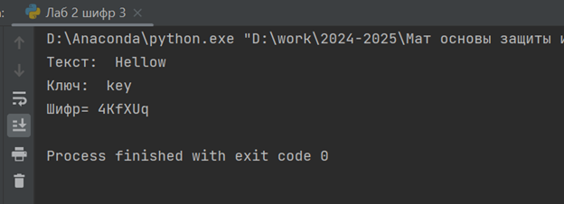

---
# Front matter
lang: ru-RU
title: "Лабораторная работа №2"
subtitle: "Математические основы защиты информации и информационной безопасности"
author: "Колчева Юлия Вячеславовна"

# Formatting
toc-title: "Содержание"
toc: true # Table of contents
toc_depth: 2
lof: true # List of figures
lot: true # List of tables
fontsize: 12pt
linestretch: 1.5
papersize: a4paper
documentclass: scrreprt
polyglossia-lang: russian
polyglossia-otherlangs: english
mainfont: PT Serif
romanfont: PT Serif
sansfont: PT Sans
monofont: PT Mono
mainfontoptions: Ligatures=TeX
romanfontoptions: Ligatures=TeX
sansfontoptions: Ligatures=TeX,Scale=MatchLowercase
monofontoptions: Scale=MatchLowercase
indent: true
pdf-engine: lualatex
header-includes:
  - \linepenalty=10 # the penalty added to the badness of each line within a paragraph (no associated penalty node) Increasing the value makes tex try to have fewer lines in the paragraph.
  - \interlinepenalty=0 # value of the penalty (node) added after each line of a paragraph.
  - \hyphenpenalty=50 # the penalty for line breaking at an automatically inserted hyphen
  - \exhyphenpenalty=50 # the penalty for line breaking at an explicit hyphen
  - \binoppenalty=700 # the penalty for breaking a line at a binary operator
  - \relpenalty=500 # the penalty for breaking a line at a relation
  - \clubpenalty=150 # extra penalty for breaking after first line of a paragraph
  - \widowpenalty=150 # extra penalty for breaking before last line of a paragraph
  - \displaywidowpenalty=50 # extra penalty for breaking before last line before a display math
  - \brokenpenalty=100 # extra penalty for page breaking after a hyphenated line
  - \predisplaypenalty=10000 # penalty for breaking before a display
  - \postdisplaypenalty=0 # penalty for breaking after a display
  - \floatingpenalty = 20000 # penalty for splitting an insertion (can only be split footnote in standard LaTeX)
  - \raggedbottom # or \flushbottom
  - \usepackage{float} # keep figures where there are in the text
  - \floatplacement{figure}{H} # keep figures where there are in the text
---

# Цель работы

Изучить шифры перестановки, реализовать программным путём маршрутное шифрование, шифрование с помощью решёток и таблицу Виженера.

# Задание

1. Реализовать маршрутное шифрование
2. Реализовать шифрование с помощью решёток
3. Реализовать шифрование с помощью таблицы Виженера

# Выполнение лабораторной работы

 
Так как я не изучала язык Julia на бакалавриате, лабораторную работу я реализовала на python. При дальнейшем изучении я перейду на новый язык.

Для реализации маршрутного шифрования мной была написана следующая программа (рис. [-@fig:001] ) :

{ #fig:001 width=70% }

В данной программе: 

2-3 строки: инициализация используемых переменных

6-10 строка: деление заданного текста на части и запись в матрицу

12-15: заполнение "переводчика" , каждой букве пароля присваевается соответсвующий столбец матрицы

Далее представлен результат работы программы (рис. [-@fig:002] )

{ #fig:002 width=70% }

Как видно, программа работает верно

Теперь представим программу шифрования с помощью решёток (рис. [-@fig:003] ) (рис. [-@fig:004] )

{ #fig:003 width=70% }

{ #fig:004 width=70% }

В данной программе: 

1-4 строки: реализация "прикладывания" решётки к имеющейся матрице

6-7 строка: "переворот" матрицы на 90 градусов

9-12: заданная "решётка"

14-17: матрица букв

19: сокращённая запись 
 
21-23: запуск функций

Посмотрим на результат работы программы, на ней представлены все повороты решёток и конечный шифр (рис. [-@fig:005] )

{ #fig:005 width=70% }

Программа работает верно. 

Реализуем последний шифр - таблицу Виженера (рис. [-@fig:006] ) (рис. [-@fig:007] ) (рис. [-@fig:008] ) 

{ #fig:004 width=70% }

{ #fig:004 width=70% }

{ #fig:004 width=70% }

{ #fig:004 width=70% }

В данной программе: 

1-7: функция задающая индексы значений, которые мы будем использовать

9-16: функция, сопоставляющая значения индексов в тексте 

18-22: сдвиг по значениям индексов

Последнее изображение  (рис. [-@fig:009] ) задаёт текст, ключ и запускает функции программы. 

Результаты работы программы (рис. [-@fig:010] )

{ #fig:010 width=70% }

# Выводы

Изучила шифры перестановки, реализовала программным путём маршрутное шифрование, шифрование с помощью решёток и таблицу Виженера.

# Список литературы

Лабораторная работа №2

Шифры перестановки [Электронный ресурс]. URL: https://esystem.rudn.ru/mod/folder/view.php?id=1150970

