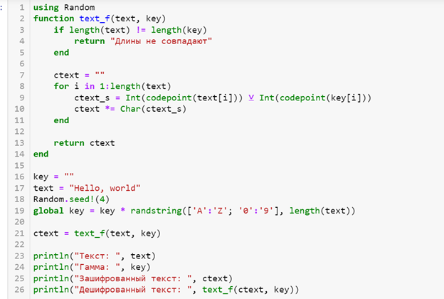

---
# Front matter
lang: ru-RU
title: "Лабораторная работа №3"
subtitle: "Математические основы защиты информации и информационной безопасности"
author: "Колчева Юлия Вячеславовна"

# Formatting
toc-title: "Содержание"
toc: true # Table of contents
toc_depth: 2
lof: true # List of figures
lot: true # List of tables
fontsize: 12pt
linestretch: 1.5
papersize: a4paper
documentclass: scrreprt
polyglossia-lang: russian
polyglossia-otherlangs: english
mainfont: PT Serif
romanfont: PT Serif
sansfont: PT Sans
monofont: PT Mono
mainfontoptions: Ligatures=TeX
romanfontoptions: Ligatures=TeX
sansfontoptions: Ligatures=TeX,Scale=MatchLowercase
monofontoptions: Scale=MatchLowercase
indent: true
pdf-engine: lualatex
header-includes:
  - \linepenalty=10 # the penalty added to the badness of each line within a paragraph (no associated penalty node) Increasing the value makes tex try to have fewer lines in the paragraph.
  - \interlinepenalty=0 # value of the penalty (node) added after each line of a paragraph.
  - \hyphenpenalty=50 # the penalty for line breaking at an automatically inserted hyphen
  - \exhyphenpenalty=50 # the penalty for line breaking at an explicit hyphen
  - \binoppenalty=700 # the penalty for breaking a line at a binary operator
  - \relpenalty=500 # the penalty for breaking a line at a relation
  - \clubpenalty=150 # extra penalty for breaking after first line of a paragraph
  - \widowpenalty=150 # extra penalty for breaking before last line of a paragraph
  - \displaywidowpenalty=50 # extra penalty for breaking before last line before a display math
  - \brokenpenalty=100 # extra penalty for page breaking after a hyphenated line
  - \predisplaypenalty=10000 # penalty for breaking before a display
  - \postdisplaypenalty=0 # penalty for breaking after a display
  - \floatingpenalty = 20000 # penalty for splitting an insertion (can only be split footnote in standard LaTeX)
  - \raggedbottom # or \flushbottom
  - \usepackage{float} # keep figures where there are in the text
  - \floatplacement{figure}{H} # keep figures where there are in the text
---

# Цель работы

Познакомиться с алгоритмом шифрования гаммированием конечной гаммой и применить его на практике.

# Задание

Реализовать алгоритм шифрования гаммированием конечной гаммой

# Выполнение лабораторной работы

 
Данная работа была выполнена на языке Julia. 

Для реализации алгоритм шифрования гаммированием конечной гаммой мной была написана следующая программа (рис. [-@fig:001] ) :

{ #fig:001 width=70% }

В данной программе: 

1 строка: подключение библиотеки для реализации выбора случайной гаммы.

2-14 строки: реализация функции для шифрования.

2-5: проверка условия, что длины текста и гаммы совпадают, иначе алгоритм не будет реализован.

8-11: основной цикл, который взаимодействует с кодами чисел и возвращает третий код, который затем преобразуется в новый символ шифр-текста. 

13: возвращаем результат работы программы - шифр-текст. 

16: задаём пустую гамму для дальнейшего заполнения

17: задаём текст, который хотим зашифровать

19: задаём гамму случайны образом длинной текста. 

21: вызываем функцию. 

23-26: вывод результатов программы.

Далее представлен результат работы программы (рис. [-@fig:002] )

{ #fig:002 width=70% }

Как видно, программа работает верно.

# Выводы

Познакомилась с алгоритмом шифрования гаммированием конечной гаммой и применила его на практике.

# Список литературы

Лабораторная работа №3

Шифрование гаммированием [Электронный ресурс]. URL: https://esystem.rudn.ru/mod/folder/view.php?id=1150972

