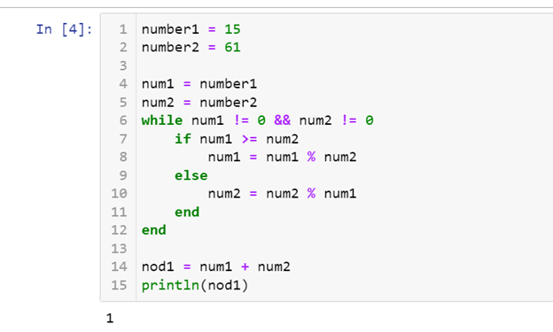
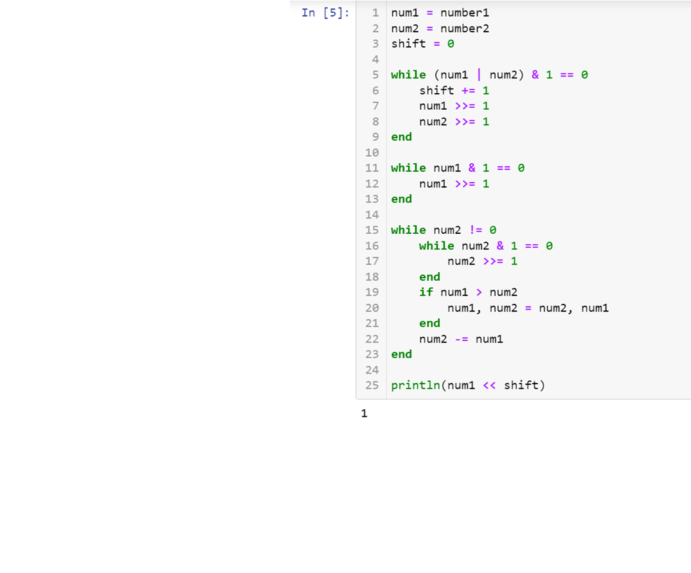
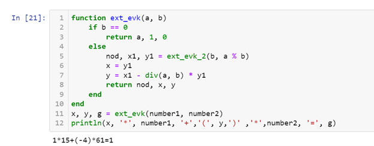
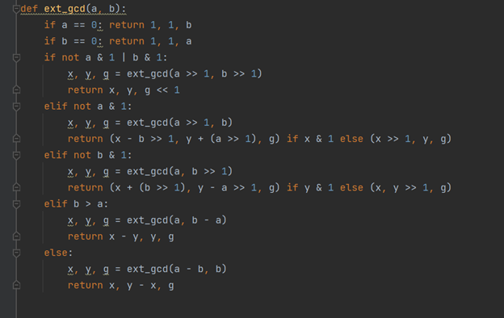
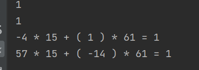

---
## Front matter
lang: ru-RU
title: Математические основы защиты информации и информационной безопасности
author: Колчева Юлия Вячеславовна
institute: РУДН, Москва, Россия

date: 23 Октября 2024

## Formatting
toc: false
slide_level: 2
theme: metropolis
header-includes: 
 - \metroset{progressbar=frametitle,sectionpage=progressbar,numbering=fraction}
 - '\makeatletter'
 - '\beamer@ignorenonframefalse'
 - '\makeatother'
aspectratio: 43
section-titles: true
---

# Лабораторная работа 4

## алгоритм Евклида

{ #fig:001 width=70% }

## Бинарный алгоритм Евклида

{ #fig:002 width=70% }

## Расширенный алгоритм Евклида

{ #fig:003 width=70% }

## Расширенный бинарный алгоритм Евклида

{ #fig:004 width=70% }

## Ответы всех программ

{ #fig:005 width=70% }

## Выводы

- Познакомилась с алгоритмами вычисления наибольшего общего делителя.

- Применила алгоритмы на практике.

## {.standout}

Спасибо за внимание!
