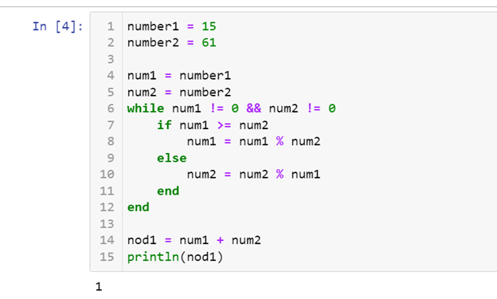
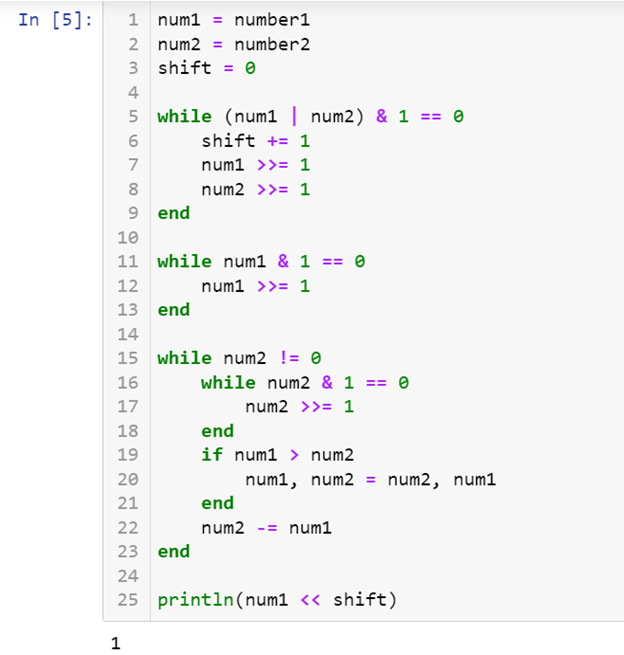
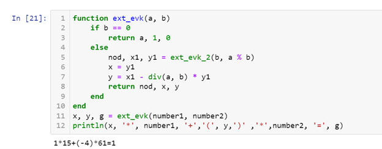
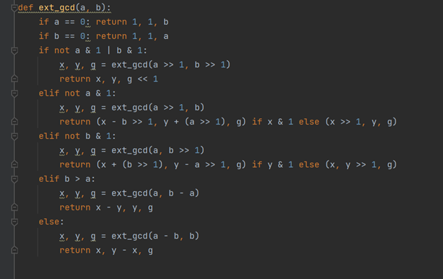
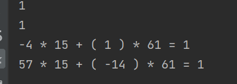

---
# Front matter
lang: ru-RU
title: "Лабораторная работа №4"
subtitle: "Математические основы защиты информации и информационной безопасности"
author: "Колчева Юлия Вячеславовна"

# Formatting
toc-title: "Содержание"
toc: true # Table of contents
toc_depth: 2
lof: true # List of figures
lot: true # List of tables
fontsize: 12pt
linestretch: 1.5
papersize: a4paper
documentclass: scrreprt
polyglossia-lang: russian
polyglossia-otherlangs: english
mainfont: PT Serif
romanfont: PT Serif
sansfont: PT Sans
monofont: PT Mono
mainfontoptions: Ligatures=TeX
romanfontoptions: Ligatures=TeX
sansfontoptions: Ligatures=TeX,Scale=MatchLowercase
monofontoptions: Scale=MatchLowercase
indent: true
pdf-engine: lualatex
header-includes:
  - \linepenalty=10 # the penalty added to the badness of each line within a paragraph (no associated penalty node) Increasing the value makes tex try to have fewer lines in the paragraph.
  - \interlinepenalty=0 # value of the penalty (node) added after each line of a paragraph.
  - \hyphenpenalty=50 # the penalty for line breaking at an automatically inserted hyphen
  - \exhyphenpenalty=50 # the penalty for line breaking at an explicit hyphen
  - \binoppenalty=700 # the penalty for breaking a line at a binary operator
  - \relpenalty=500 # the penalty for breaking a line at a relation
  - \clubpenalty=150 # extra penalty for breaking after first line of a paragraph
  - \widowpenalty=150 # extra penalty for breaking before last line of a paragraph
  - \displaywidowpenalty=50 # extra penalty for breaking before last line before a display math
  - \brokenpenalty=100 # extra penalty for page breaking after a hyphenated line
  - \predisplaypenalty=10000 # penalty for breaking before a display
  - \postdisplaypenalty=0 # penalty for breaking after a display
  - \floatingpenalty = 20000 # penalty for splitting an insertion (can only be split footnote in standard LaTeX)
  - \raggedbottom # or \flushbottom
  - \usepackage{float} # keep figures where there are in the text
  - \floatplacement{figure}{H} # keep figures where there are in the text
---

# Цель работы

Познакомиться с алгоритмами вычисления наибольшего общего делителя и практическая реализация алгоритмов. 

# Задание

Реализовать алгоритмы вычисления наибольшего общего делителя, рассмотренные в лабораторной работе.

# Выполнение лабораторной работы

 
Данная работа была выполнена на языке Julia. 

Для реализации алгоритма Евклида была написана следующая программа (рис. [-@fig:001] ) :

{ #fig:001 width=70% }

В данной программе: 

1-5 строки: задание чисел, НОД которого ищем.

6-12: реализация самого алгоритма Евклида: делим наибольшее число на наименьшее и записываем остаток до тех пор, пока одно из них не обнулится. 

14: запись НОД в переменную.

15: вывод результата

Мы можем видеть результат на (рис. [-@fig:001] ) . Программа работает верно.

Для реализации бинарного алгоритма Евклида была написана следующая программа (рис. [-@fig:002] )

{ #fig:002 width=70% }

В данной программе: 

1-3 строки: задание чисел, НОД которого ищем, обнуление "сдвига"

5-23: реализация самого бинарного алгоритма Евклида: смотрим на четность получающихся чисел и записываем насколько нам необходимо "сдвинуть" число, чтобы получить НОД 

25: сдвиг влево и вывод получившегося НОД.

Для реализации расширенного алгоритма Евклида была написана следующая программа (рис. [-@fig:003] )

{ #fig:003 width=70% }

1 строка: зададим рекурсивную функцию

2-3: если второе число равно нулю, возвращаем ответ из трёх чисел

5-7: в ином случае запускаем рекурсию, а затем выводим ответ согласно формуле на строке 7.

8: возвращаем вывод в качестве получившегося НОД, числа, что нужно домножить на первую цифру и на вторую, чтобы получить НОД.

11: вывоз функции и сохранение данных в переменные

12: вывод на экран. 

Для реализации расширенного бинарного алгоритма Евклида была написана следующая программа (рис. [-@fig:004] )

{ #fig:004 width=70% }

Данная программа также работает рекурсивно, рассматривая 4 случая:
1) а четное 
2) а нечетное и b четное 
3) а нечетное и b нечетное, b > a 
4) а нечетное и b нечетное , b < a

Каждая рекурсия сдвигает биты в цифрах, формируя окончательный ответ.

В итоге выводит три значения: НОД, число, что нужно домножить на первую цифру и на вторую, чтобы получить НОД.

Выводы всех программ (рис. [-@fig:005] ) 

{ #fig:005 width=70% }

Необходимо обратить внимание, что расширенные алгоритмы выводят разные множители, однако оба ответа верны и дают верный НОД.

# Выводы

Познакомилась с алгоритмами вычисления наибольшего общего делителя и практически реализовала алгоритмы. 

# Список литературы

Лабораторная работа №4

Вычисление наибольшего общего делителя [Электронный ресурс]. URL: https://esystem.rudn.ru/mod/folder/view.php?id=1150974

