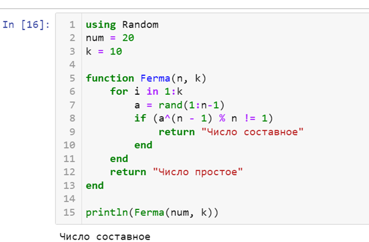
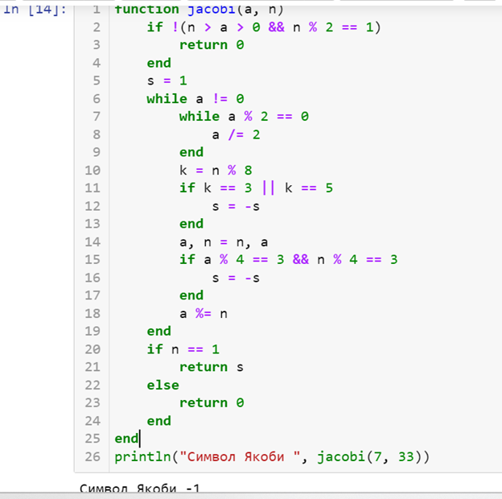
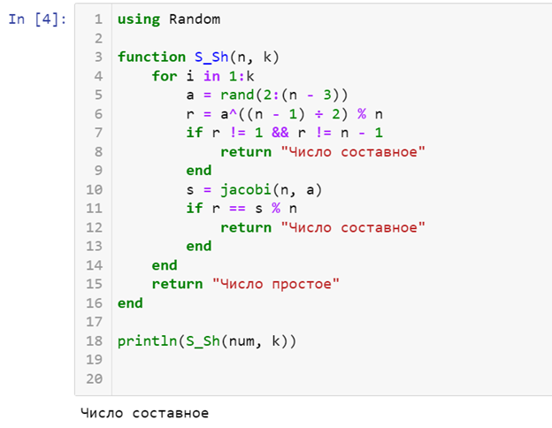
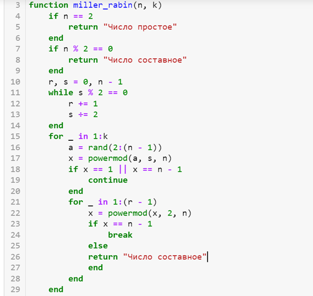
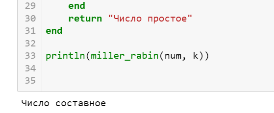
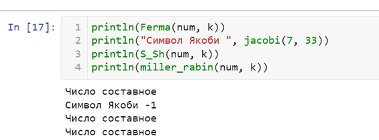

---
# Front matter
lang: ru-RU
title: "Лабораторная работа №5"
subtitle: "Математические основы защиты информации и информационной безопасности"
author: "Колчева Юлия Вячеславовна"

# Formatting
toc-title: "Содержание"
toc: true # Table of contents
toc_depth: 2
lof: true # List of figures
lot: true # List of tables
fontsize: 12pt
linestretch: 1.5
papersize: a4paper
documentclass: scrreprt
polyglossia-lang: russian
polyglossia-otherlangs: english
mainfont: PT Serif
romanfont: PT Serif
sansfont: PT Sans
monofont: PT Mono
mainfontoptions: Ligatures=TeX
romanfontoptions: Ligatures=TeX
sansfontoptions: Ligatures=TeX,Scale=MatchLowercase
monofontoptions: Scale=MatchLowercase
indent: true
pdf-engine: lualatex
header-includes:
  - \linepenalty=10 # the penalty added to the badness of each line within a paragraph (no associated penalty node) Increasing the value makes tex try to have fewer lines in the paragraph.
  - \interlinepenalty=0 # value of the penalty (node) added after each line of a paragraph.
  - \hyphenpenalty=50 # the penalty for line breaking at an automatically inserted hyphen
  - \exhyphenpenalty=50 # the penalty for line breaking at an explicit hyphen
  - \binoppenalty=700 # the penalty for breaking a line at a binary operator
  - \relpenalty=500 # the penalty for breaking a line at a relation
  - \clubpenalty=150 # extra penalty for breaking after first line of a paragraph
  - \widowpenalty=150 # extra penalty for breaking before last line of a paragraph
  - \displaywidowpenalty=50 # extra penalty for breaking before last line before a display math
  - \brokenpenalty=100 # extra penalty for page breaking after a hyphenated line
  - \predisplaypenalty=10000 # penalty for breaking before a display
  - \postdisplaypenalty=0 # penalty for breaking after a display
  - \floatingpenalty = 20000 # penalty for splitting an insertion (can only be split footnote in standard LaTeX)
  - \raggedbottom # or \flushbottom
  - \usepackage{float} # keep figures where there are in the text
  - \floatplacement{figure}{H} # keep figures where there are in the text
---

# Цель работы

Познакомиться с вероятностными алгоритмами проверки чисел на простоту.

# Задание

Реализовать вероятностные алгоритмы проверки чисел на простоту. 

# Выполнение лабораторной работы

 
Данная работа была выполнена на языке Julia. 

Для реализации теста Ферма была написана следующая программа (рис. [-@fig:001] ) :

{ #fig:001 width=70% }

В данной программе: 

2-3 строки: задание числа, которое нужно проверить на простоту, и количество проверок

5: задание функции 

6: цикл проверки выполняется k раз

7: берём случайное число а в диапазоне [1,n-1] 

8: проводим проверку условия, при невыполнении сразу завершаем работу. 

9-13: выводим результат, закрываем функцию 

Мы можем видеть результат на (рис. [-@fig:001] ) . Программа работает верно.

Для реализации поиска символа Якоби была написана следующая программа (рис. [-@fig:002] )

{ #fig:002 width=70% }

В данной программе: 

1-5 строки: задание функции, проверка условий для вычисления символа Якоби

6-25: реализация алгоритма: проверка трёх условий и действия согласно этим условиям: смена знака символа при четном и нечетном k, проверка остатоков от деления.

26: вывод результата работы программы. В данном случае я вычислила символ Якоби 7 и 33. Вывод представлен на скриншоте.

Для реализации теста Соловэя-Штрассена была написана следующая программа (рис. [-@fig:003] )

{ #fig:003 width=70% }

3 строка: зададим функцию

4: повторим проверку k раз

5-16: реализация теста: генерируем случайное число а, вычисляем число r по формуле в строке 6, а затем проверяем получившееся значение на два условия. Если оно не проходит проверку, то сразу заканчиваем работу программы. Далее следует ещё одна проверка условия строки 11, при провале также заканчиваем работу. 

18: вывод на экран. Результат работы программы с числом 20 и 10 проверками.

Для реализации теста Миллера-Рабина была написана следующая программа (рис. [-@fig:004] )

{ #fig:004 width=70% }

В данной программе:

3 строка: задаём функцию.

4-9: отсеивание числа 2 и остальных чётных чисел.

11-29: реализация алгоритма: выбираем случайное число а и вычисляем число х по формуле в строке 17. При условии в строке 18 выполняем дополнительные действия как вычисление остатка от деления квадрата х на проверяемое число. Если число прошло все проверки k раз, мы определяем его как "вероятно, простое".

Результаты работы программы с числом 20 и числом проверок 10 (рис. [-@fig:005] )

{ #fig:005 width=70% }

Выводы всех программ (рис. [-@fig:006] ) 

{ #fig:006 width=70% }

Алгоритмы вывели верный результат.

# Выводы

Познакомилась с вероятностными алгоритмами проверки чисел на простоту и реализовала их на практике.

# Список литературы

Лабораторная работа №5

Вероятностные алгоритмы проверки чисел на простоту [Электронный ресурс]. URL: https://esystem.rudn.ru/mod/folder/view.php?id=1150976

