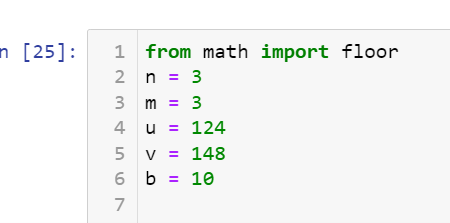
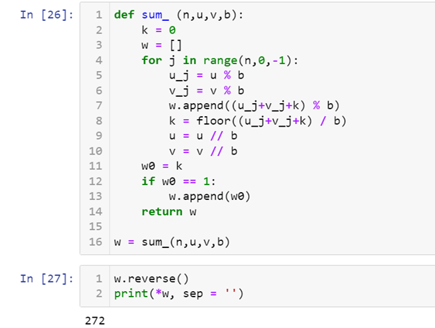
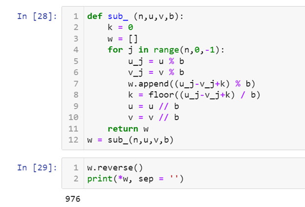
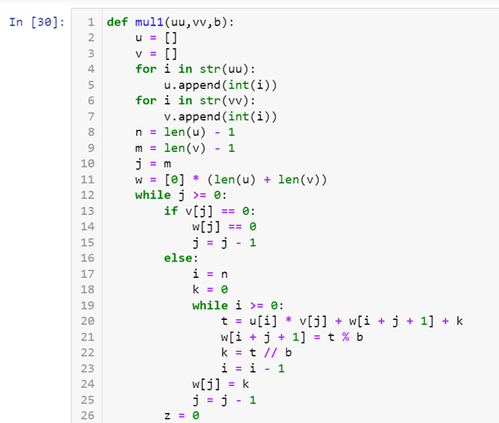
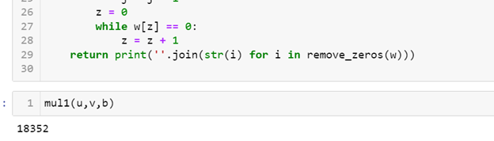
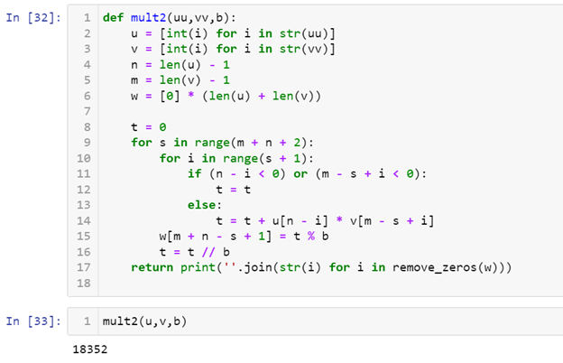
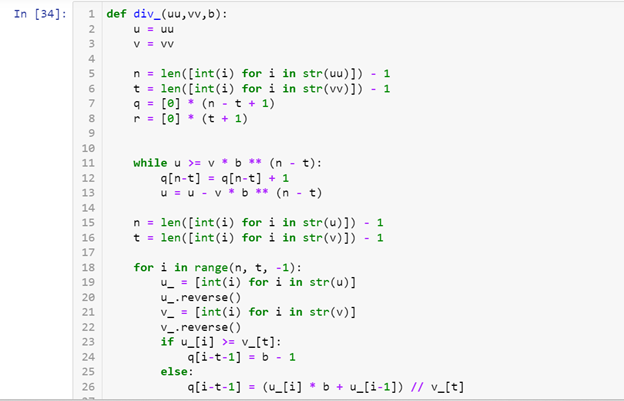
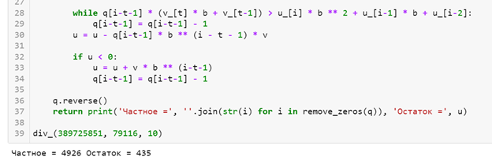

---
# Front matter
lang: ru-RU
title: "Лабораторная работа №8"
subtitle: "Математические основы защиты информации и информационной безопасности"
author: "Колчева Юлия Вячеславовна"

# Formatting
toc-title: "Содержание"
toc: true # Table of contents
toc_depth: 2
lof: true # List of figures
lot: true # List of tables
fontsize: 12pt
linestretch: 1.5
papersize: a4paper
documentclass: scrreprt
polyglossia-lang: russian
polyglossia-otherlangs: english
mainfont: PT Serif
romanfont: PT Serif
sansfont: PT Sans
monofont: PT Mono
mainfontoptions: Ligatures=TeX
romanfontoptions: Ligatures=TeX
sansfontoptions: Ligatures=TeX,Scale=MatchLowercase
monofontoptions: Scale=MatchLowercase
indent: true
pdf-engine: lualatex
header-includes:
  - \linepenalty=10 # the penalty added to the badness of each line within a paragraph (no associated penalty node) Increasing the value makes tex try to have fewer lines in the paragraph.
  - \interlinepenalty=0 # value of the penalty (node) added after each line of a paragraph.
  - \hyphenpenalty=50 # the penalty for line breaking at an automatically inserted hyphen
  - \exhyphenpenalty=50 # the penalty for line breaking at an explicit hyphen
  - \binoppenalty=700 # the penalty for breaking a line at a binary operator
  - \relpenalty=500 # the penalty for breaking a line at a relation
  - \clubpenalty=150 # extra penalty for breaking after first line of a paragraph
  - \widowpenalty=150 # extra penalty for breaking before last line of a paragraph
  - \displaywidowpenalty=50 # extra penalty for breaking before last line before a display math
  - \brokenpenalty=100 # extra penalty for page breaking after a hyphenated line
  - \predisplaypenalty=10000 # penalty for breaking before a display
  - \postdisplaypenalty=0 # penalty for breaking after a display
  - \floatingpenalty = 20000 # penalty for splitting an insertion (can only be split footnote in standard LaTeX)
  - \raggedbottom # or \flushbottom
  - \usepackage{float} # keep figures where there are in the text
  - \floatplacement{figure}{H} # keep figures where there are in the text
---

# Цель работы

Познакомиться с целочисленной арифметикой многократной точности.

# Задание

Реализовать алгоритмы, производящие операции над числами. 

# Выполнение лабораторной работы

Для всех последующих алгоритмов были использованы числа u и v (рис. [-@fig:001] ) :

{ #fig:001 width=70% }

Для реализации алгоритма сложения целых чисел была написана следующая программа (рис. [-@fig:002] )

{ #fig:002 width=70% }

В данной программе: 

1-3 строки: задаём функцию и начальные данные

4-10: реализация алгоритма: отделяем от числа цифры, производим с ними вычисления при помощи формул из лабораторной и отсекаем цифру.

13: запись цифры ответа в список. 

В данном случае я вычислила сумму 124 и 148. Вывод представлен на скриншоте.

Для реализации разности была написана следующая программа (рис. [-@fig:003] )

{ #fig:003 width=70% }

Программа реализована аналогично предыдущей, только со знаком минуса. Вывод представлен на сриншоте (рис. [-@fig:003] )

Для реализации теста умножения столбиком была написана следующая программа (рис. [-@fig:004] ) (рис. [-@fig:005] )

{ #fig:004 width=70% }

{ #fig:005 width=70% }

В данной программе:

1-3 строка: задаём функцию и подготавливаем переменные.

4-29: реализация алгоритма: присваиваем нулевые значения, отделяем цифры от числа и вычисляем новое значение по нескольким формулам, затем отсекаем цифру от числа и начинаем алгоритм заново. 

Результаты работы программы с числами 124 и 148 (рис. [-@fig:005] )

Для реализации теста умножения быстрым столбиком была написана следующая программа (рис. [-@fig:006] )

{ #fig:006 width=70% }

Данная программа считает произведение более коротким образом. Вывод можно увидеть на скриншоте, он такой же, как и в предыдущем алгоритме, но считается быстрее. (рис. [-@fig:006] )

И в конце, алгоритм для деления многоразрядных целых чисел (рис. [-@fig:007] ) (рис. [-@fig:008] )

{ #fig:007 width=70% }

{ #fig:008 width=70% }

Данный алгоритм так же путём отделения цифр от чисел считает их частное и записывает остаток. С каждой цифрой работаем отдельно и записываем что мы взяли от других разрядов. 

Выводы представлены на скриншоте (рис. [-@fig:008] )

# Выводы

Познакомилась с целочисленной арифметикой многократной точности. Реализовала пять алгоритмов действий с многоразрядными числами.

# Список литературы

Лабораторная работа №8

Целочисленная арифметикой многократной точности [Электронный ресурс]. URL: https://esystem.rudn.ru/mod/folder/view.php?id=1150982

