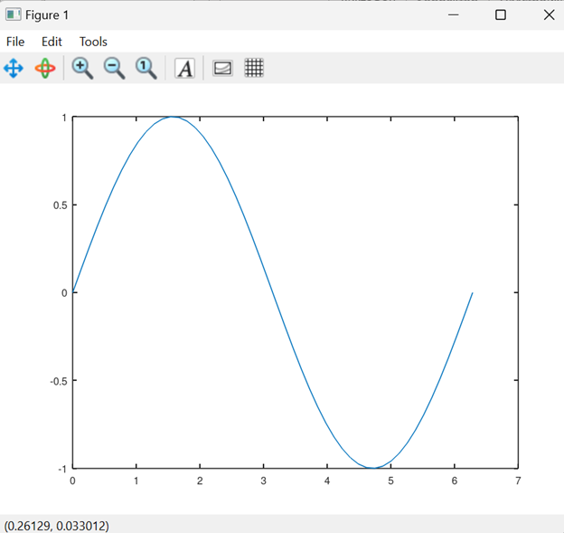

---
# Front matter
lang: ru-RU
title: "Лабораторная работа №3"
subtitle: "Научное программирование"
author: "Колчева Юлия Вячеславовна"

# Formatting
toc-title: "Содержание"
toc: true # Table of contents
toc_depth: 2
lof: true # List of figures
lot: true # List of tables
fontsize: 12pt
linestretch: 1.5
papersize: a4paper
documentclass: scrreprt
polyglossia-lang: russian
polyglossia-otherlangs: english
mainfont: PT Serif
romanfont: PT Serif
sansfont: PT Sans
monofont: PT Mono
mainfontoptions: Ligatures=TeX
romanfontoptions: Ligatures=TeX
sansfontoptions: Ligatures=TeX,Scale=MatchLowercase
monofontoptions: Scale=MatchLowercase
indent: true
pdf-engine: lualatex
header-includes:
  - \linepenalty=10 # the penalty added to the badness of each line within a paragraph (no associated penalty node) Increasing the value makes tex try to have fewer lines in the paragraph.
  - \interlinepenalty=0 # value of the penalty (node) added after each line of a paragraph.
  - \hyphenpenalty=50 # the penalty for line breaking at an automatically inserted hyphen
  - \exhyphenpenalty=50 # the penalty for line breaking at an explicit hyphen
  - \binoppenalty=700 # the penalty for breaking a line at a binary operator
  - \relpenalty=500 # the penalty for breaking a line at a relation
  - \clubpenalty=150 # extra penalty for breaking after first line of a paragraph
  - \widowpenalty=150 # extra penalty for breaking before last line of a paragraph
  - \displaywidowpenalty=50 # extra penalty for breaking before last line before a display math
  - \brokenpenalty=100 # extra penalty for page breaking after a hyphenated line
  - \predisplaypenalty=10000 # penalty for breaking before a display
  - \postdisplaypenalty=0 # penalty for breaking after a display
  - \floatingpenalty = 20000 # penalty for splitting an insertion (can only be split footnote in standard LaTeX)
  - \raggedbottom # or \flushbottom
  - \usepackage{float} # keep figures where there are in the text
  - \floatplacement{figure}{H} # keep figures where there are in the text
---

# Цель работы

Изучить идеологию и применение языка Octave, познакомится с основными командами и возможностями языка.

# Задание

 Разобраться со спецификой языка и выполнить основные операции. 

1. Простейшие операции.
2. Операции с векторами.
3. Вычисление проектора.
4. Матричные операции.
5. Построение простейших графиков.
6. Построение двух графиков на одном чертеже
7. Построение графика сложной функции
8. Сравнение циклов и операций над векторами

# Выполнение лабораторной работы

 Для начала работы с программой включим журналирование сессии командой diary on. Затем приступим к выполнению первого этапа - простейших операций. Сначала используем как простейший калькулятор и вычислим выражение. Зададим вектор u и покажем как сделать вектор-строку и вектор-столбец. Зададим матрицу A. ( рис. [-@fig:001] )

{ #fig:001 width=70% }

Теперь зададим два вектора-столбца v и u, с которыми будем совершать операции. (рис. [-@fig:002] ) 

{ #fig:002 width=70% }

Осуществим несколько операций с ними: сложение, скалярное умножение, векторное умножение, вычисление нормы. ( рис. [-@fig:003] )

{ #fig:003 width=70% }

Приступим к следующему этапу работы: вычислим проекции. Для этого введём два вектора строки. Выведя необходимую формулу, вычислим её в octave. ( рис. [-@fig:004] )

{ #fig:004 width=70% }

Следующий этап - матричные операции. Введём две матрицы - А и В. Далее проведём несколько операций над ними. Сначала вычислим произведение матриц А*В  (рис. [-@fig:005] ) , а затем произведение транспонированной В на А. Так же вычислим значение выражения 2*A − 4*I, где I - единичная матрица. ( рис. [-@fig:006] )

{ #fig:005 width=70% }

{ #fig:006 width=70% }

Теперь надём обратную матрицу А и отыщем её собственне значения. (рис. [-@fig:007] )

{ #fig:007 width=70% }

Теперь научимся рисовать графики. Для начала нарисуем простейший график (рис. [-@fig:010] ) , задав х (рис. [-@fig:008] ) и у (рис. [-@fig:009] )

{ #fig:008 width=70% }

{ #fig:009 width=70% }

{ #fig:010 width=70% }

Улучшим график, зададим красный цвет для линии и сделаем её толще. Поправим диапозон осей, нарисуем сетку, подпишем оси, сделаем заголовок графика, зададим легенду и в итоге получим такой график (рис. [-@fig:011] ) ( рис. [-@fig:012] )

{ #fig:011 width=70% }

{ #fig:012 width=70% }

Теперь попробуем начертить два графика на одном чертеже. Для этого используем команду hold on и строим два графика: точки и регрессию. (рис. [-@fig:013] )

{ #fig:013 width=70% }

Получаем такой график (рис. [-@fig:014] )

{ #fig:014 width=70% }

Теперь построим график сложной функции. Для начала попробуем задать постройку графика напрямую, однако тут же получим ошибку. Действительно, мы задали в выражении матричное умножение, однако нам необходимо поэлементное. Использем поэлементное возведение в степень .^ и поэлементное умножение .* (рис. [-@fig:015] )

{ #fig:015 width=70% }

В итоге получаем исправный график функции (рис. [-@fig:016] )

{ #fig:016 width=70% }

Сохраним рисунок на компьютере в разных форматах (рис. [-@fig:020] )

{ #fig:020 width=70% }

Приступим к выполнению последнего этапа: сравнение циклов и операций над векторами.
Очистим память и проверим сумму чисел с помощью цикла. Так же добавим таймер, чтобы посмотреть, сколько времени понадобилось программе для реализации действия. (рис. [-@fig:017] )

{ #fig:017 width=70% }

В итоге получим ответ (рис. [-@fig:018] )

{ #fig:018 width=70% }

Теперь посчитаем сумму при помощи векторов (рис. [-@fig:019] )

{ #fig:019 width=70% }

Как можно заметить, сумма равна одному и тому же значению, но на вторую операцию времени затрачено меньше. Следовательно, если есть возможность, то лучше осуществлять операции при помощи векторов. 

Завершаем работу командой diary off, чтобы закрыть запись в файл. (рис. [-@fig:019] )

# Выводы

Изучила идеологию и применение языка Octave, познакомилась с основными командами и возможностями языка.

# Список литературы

Лабораторная работа №3

Лабораторная работа № 3. Введение в работу с Octave [Электронный ресурс]. 2019. URL:https://esystem.rudn.ru/pluginfile.php/2372902/mod_resource/content/3/003-octave-intro.pdf

