---
# Front matter
lang: ru-RU
title: "Лабораторная работа №5"
subtitle: "Научное программирование"
author: "Колчева Юлия Вячеславовна"

# Formatting
toc-title: "Содержание"
toc: true # Table of contents
toc_depth: 2
lof: true # List of figures
lot: true # List of tables
fontsize: 12pt
linestretch: 1.5
papersize: a4paper
documentclass: scrreprt
polyglossia-lang: russian
polyglossia-otherlangs: english
mainfont: PT Serif
romanfont: PT Serif
sansfont: PT Sans
monofont: PT Mono
mainfontoptions: Ligatures=TeX
romanfontoptions: Ligatures=TeX
sansfontoptions: Ligatures=TeX,Scale=MatchLowercase
monofontoptions: Scale=MatchLowercase
indent: true
pdf-engine: lualatex
header-includes:
  - \linepenalty=10 # the penalty added to the badness of each line within a paragraph (no associated penalty node) Increasing the value makes tex try to have fewer lines in the paragraph.
  - \interlinepenalty=0 # value of the penalty (node) added after each line of a paragraph.
  - \hyphenpenalty=50 # the penalty for line breaking at an automatically inserted hyphen
  - \exhyphenpenalty=50 # the penalty for line breaking at an explicit hyphen
  - \binoppenalty=700 # the penalty for breaking a line at a binary operator
  - \relpenalty=500 # the penalty for breaking a line at a relation
  - \clubpenalty=150 # extra penalty for breaking after first line of a paragraph
  - \widowpenalty=150 # extra penalty for breaking before last line of a paragraph
  - \displaywidowpenalty=50 # extra penalty for breaking before last line before a display math
  - \brokenpenalty=100 # extra penalty for page breaking after a hyphenated line
  - \predisplaypenalty=10000 # penalty for breaking before a display
  - \postdisplaypenalty=0 # penalty for breaking after a display
  - \floatingpenalty = 20000 # penalty for splitting an insertion (can only be split footnote in standard LaTeX)
  - \raggedbottom # or \flushbottom
  - \usepackage{float} # keep figures where there are in the text
  - \floatplacement{figure}{H} # keep figures where there are in the text
---

# Цель работы

Изучение языка Octave, знакомство со способами работы с графиками

# Задание

 Разобраться со спецификой языка и выполнить операции. 

1. Подгонка полиномиальной кривой
2. Матричные преобразования:
	а. Вращение
	б. Отражение относительно кривой
	в. Дилатация

# Выполнение лабораторной работы

 Для начала работы с программой включим журналирование сессии командой diary on. Затем приступим к выполнению первого этапа - подгонке полиномиальной кривой. Для начала заданим матрицу D и разложим её на два вектора ( рис. [-@fig:001] )

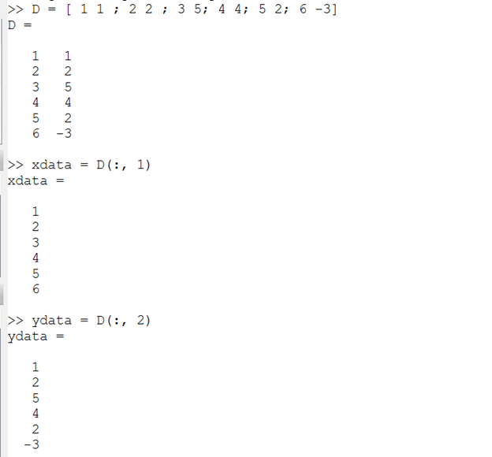{ #fig:001 width=70% }

Построим получившиеся значение на графике (рис. [-@fig:002] ) 

{ #fig:002 width=70% }

Построим уравнение вида y = ax^2 + bx + c

Для начала покажем как создать матрицу А ( рис. [-@fig:003] )

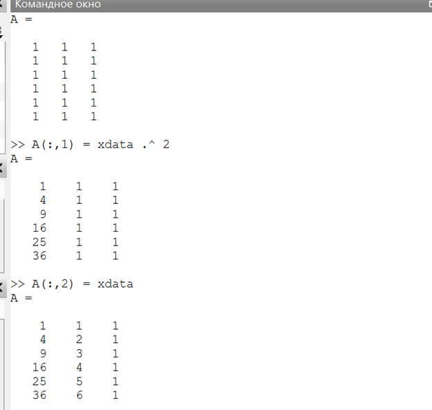{ #fig:003 width=70% }

И значения, которые мы будем использовать ( рис. [-@fig:004] )

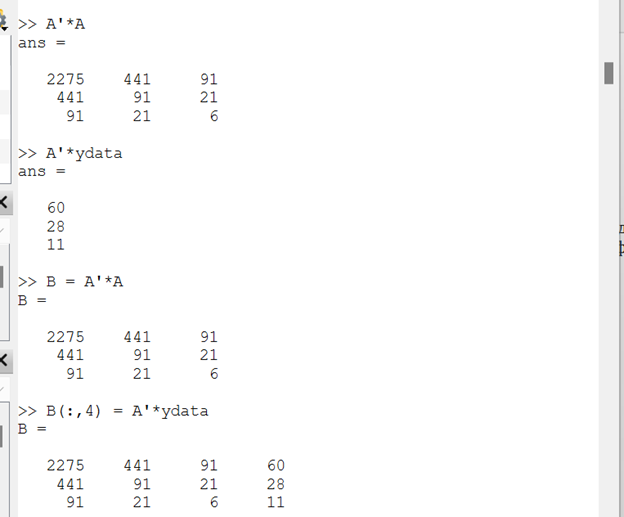{ #fig:004 width=70% }

Решим задачу методом Гаусса  (рис. [-@fig:005] ) 

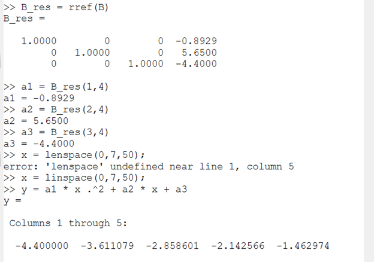{ #fig:005 width=70% }

Построим соответствующий график параболы. Процесс подгонки может быть автоматизирован встроенными функциями Octave. Для этого мы можем использовать встроенную функцию
для подгонки полинома polyfit. На скриншоте показан сначала код для паработы, а затем для втсроенной фунции ( рис. [-@fig:006] )

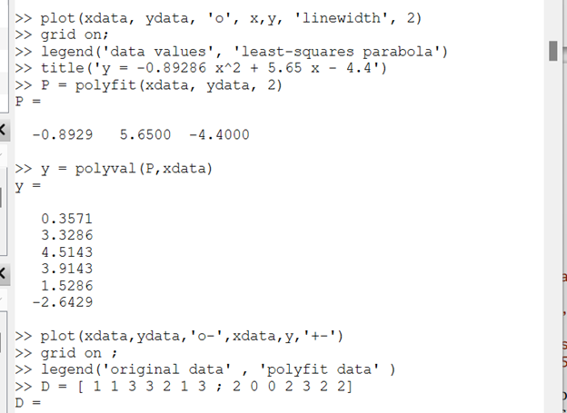{ #fig:006 width=70% }

Из предыдущего кода получились такие графики (рис. [-@fig:007] ) (рис. [-@fig:008] )

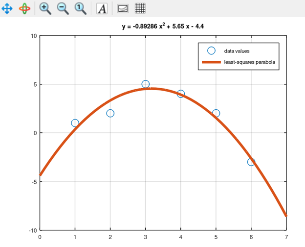{ #fig:007 width=70% }

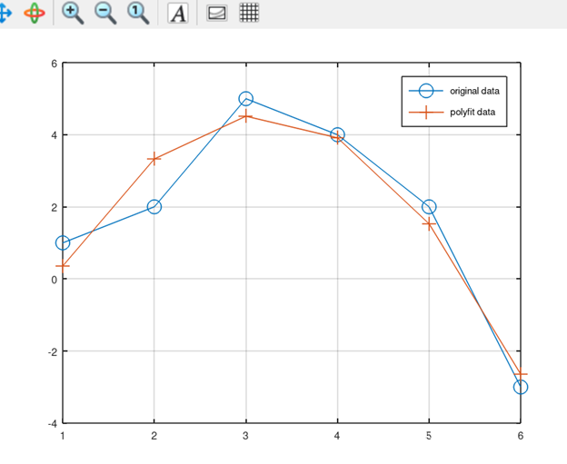{ #fig:008 width=70% }

Приступим к разделу матричных преобразований. Для начала нарисуем простой домик, с которым будем работать (рис. [-@fig:009] )

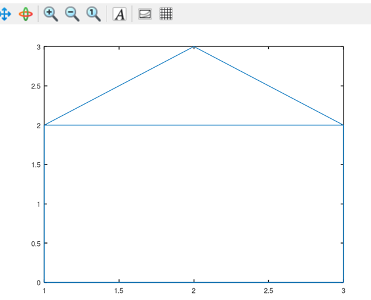{ #fig:009 width=70% }

Повернём его на 90 и на 225 градусов. Вращения
могут быть получены с использованием умножения на специальную матрицу. Вначале переведём угол в радианы. (рис. [-@fig:010] )

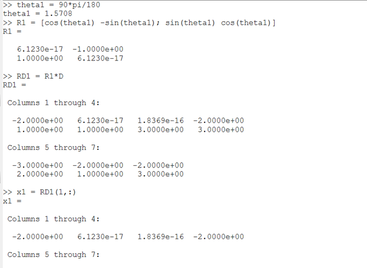{ #fig:010 width=70% }

Для второго отражения выполняем те же самые действия. В итоге получаем такой рисунок (рис. [-@fig:011] )

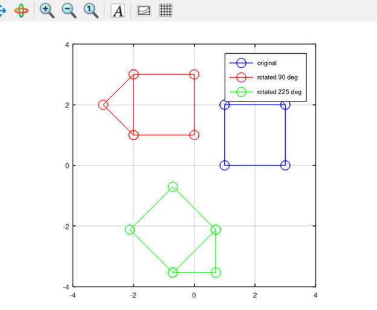{ #fig:011 width=70% }

Теперь приступим к отражению. Отразим граф дома относительно прямой y = x. Зададим матрицу отражения и нарисуем график. (рис. [-@fig:012] )

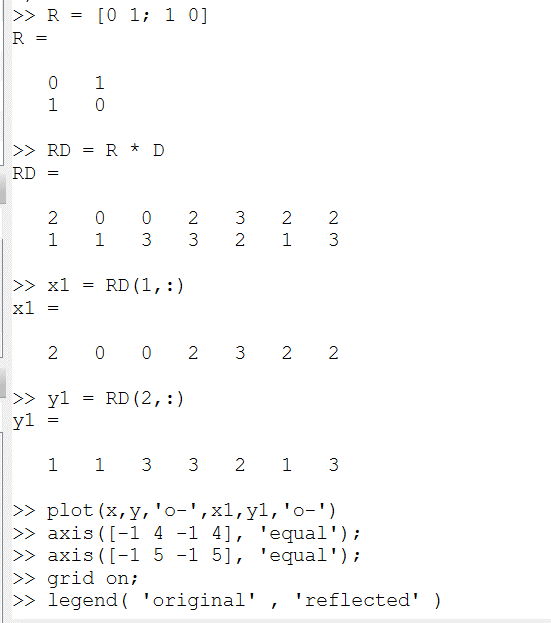{ #fig:012 width=70% }

Получаем график (рис. [-@fig:013] )

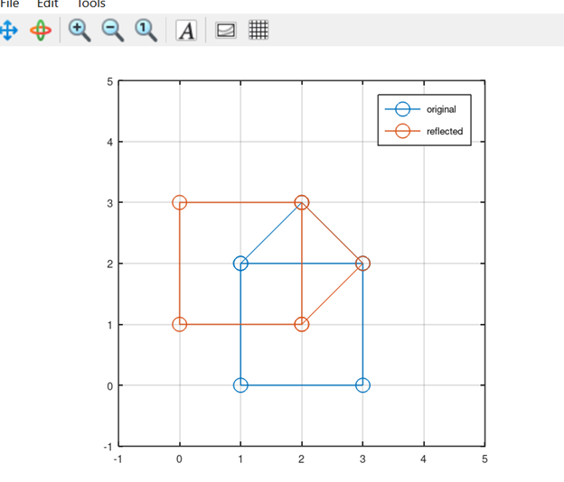{ #fig:013 width=70% }

И последнее - расширение. Увеличим граф в два раза. Заданим матрицу T и умножим на неё. (рис. [-@fig:014] )

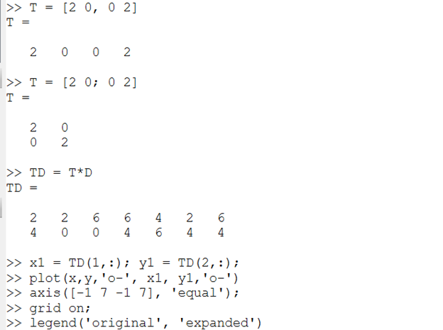{ #fig:014 width=70% }

Получаем график (рис. [-@fig:015] )

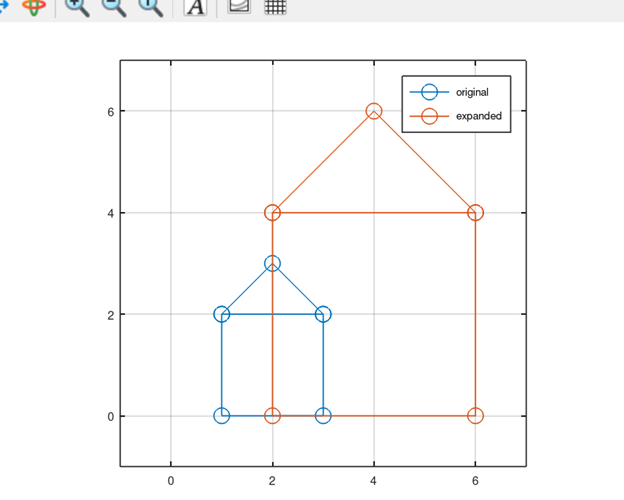{ #fig:015 width=70% }

На этом лабораторная работа закончена.

# Выводы

Познакомилась со способами работы с графиками.

# Список литературы

Лабораторная работа №5

Лабораторная работа № 5. Введение в работу с Octave [Электронный ресурс]. 2019. URL:https://esystem.rudn.ru/pluginfile.php/2372906/mod_resource/content/2/README.pdf

