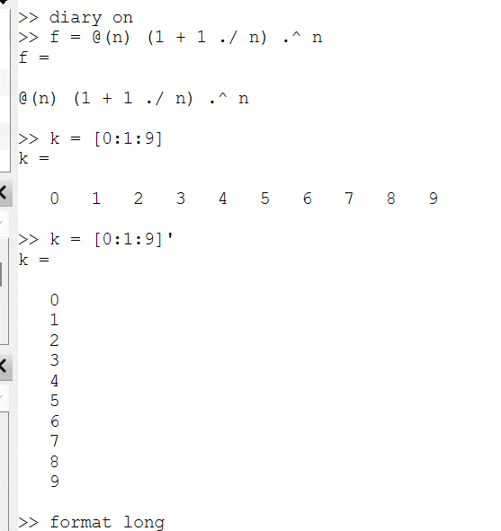
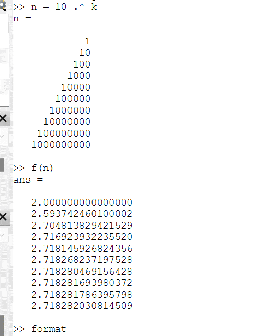
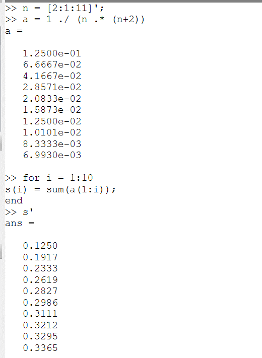
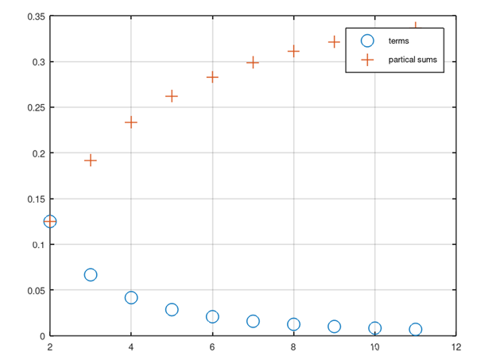
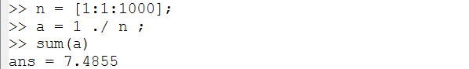
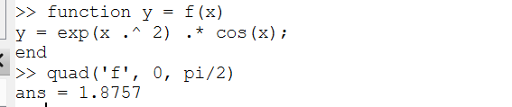
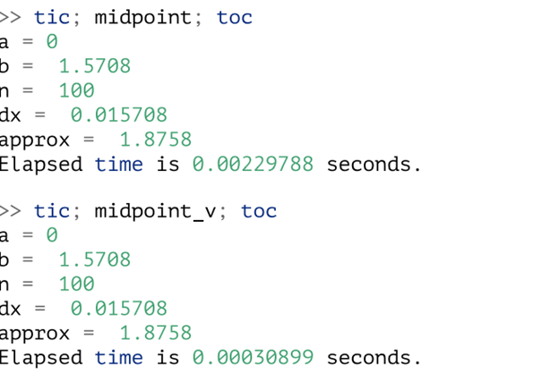

---
## Front matter
lang: ru-RU
title: Научное программирование
author: Колчева Юлия Вячеславовна
institute: РУДН, Москва, Россия

date: 23 Ноября 2024

## Formatting
toc: false
slide_level: 2
theme: metropolis
header-includes: 
 - \metroset{progressbar=frametitle,sectionpage=progressbar,numbering=fraction}
 - '\makeatletter'
 - '\beamer@ignorenonframefalse'
 - '\makeatother'
aspectratio: 43
section-titles: true
---

# Лабораторная работа 6

## Пределы

{ #fig:001 width=70% }

## Пределы

{ #fig:002 width=70% }

## Частичные суммы

{ #fig:003 width=70% }

## Частичные суммы

{ #fig:005 width=70% }

## Суммы ряда

{ #fig:006 width=70% }

## Вычисление интегралов

{ #fig:007 width=70% }

## Аппроксимирование суммами

{ #fig:010 width=70% }

## Выводы

- Изучила способы применения языка Octave.

- Познакомилась с методами работы с последовательностями, пределами, рядами.

## {.standout}

Спасибо за внимание!
