---
# Front matter
lang: ru-RU
title: "Лабораторная работа №7"
subtitle: "Научное программирование"
author: "Колчева Юлия Вячеславовна"

# Formatting
toc-title: "Содержание"
toc: true # Table of contents
toc_depth: 2
lof: true # List of figures
lot: true # List of tables
fontsize: 12pt
linestretch: 1.5
papersize: a4paper
documentclass: scrreprt
polyglossia-lang: russian
polyglossia-otherlangs: english
mainfont: PT Serif
romanfont: PT Serif
sansfont: PT Sans
monofont: PT Mono
mainfontoptions: Ligatures=TeX
romanfontoptions: Ligatures=TeX
sansfontoptions: Ligatures=TeX,Scale=MatchLowercase
monofontoptions: Scale=MatchLowercase
indent: true
pdf-engine: lualatex
header-includes:
  - \linepenalty=10 # the penalty added to the badness of each line within a paragraph (no associated penalty node) Increasing the value makes tex try to have fewer lines in the paragraph.
  - \interlinepenalty=0 # value of the penalty (node) added after each line of a paragraph.
  - \hyphenpenalty=50 # the penalty for line breaking at an automatically inserted hyphen
  - \exhyphenpenalty=50 # the penalty for line breaking at an explicit hyphen
  - \binoppenalty=700 # the penalty for breaking a line at a binary operator
  - \relpenalty=500 # the penalty for breaking a line at a relation
  - \clubpenalty=150 # extra penalty for breaking after first line of a paragraph
  - \widowpenalty=150 # extra penalty for breaking before last line of a paragraph
  - \displaywidowpenalty=50 # extra penalty for breaking before last line before a display math
  - \brokenpenalty=100 # extra penalty for page breaking after a hyphenated line
  - \predisplaypenalty=10000 # penalty for breaking before a display
  - \postdisplaypenalty=0 # penalty for breaking after a display
  - \floatingpenalty = 20000 # penalty for splitting an insertion (can only be split footnote in standard LaTeX)
  - \raggedbottom # or \flushbottom
  - \usepackage{float} # keep figures where there are in the text
  - \floatplacement{figure}{H} # keep figures where there are in the text
---

# Цель работы

Изучение языка Octave, знакомство с методами построения графиков. 

# Задание

 Разобраться со спецификой языка и выполнить операции. 

1. Параметрические графики
2. Полярные координаты
3. Графики неявных функций
4. Комплексные числа
5. Специальные функции

# Выполнение лабораторной работы

 Для начала работы с программой включим журналирование сессии командой diary on. Затем приступим к выполнению первого этапа - работе с параметрическими графиками. Определяем уравнение циклоиды ( рис. [-@fig:001] )

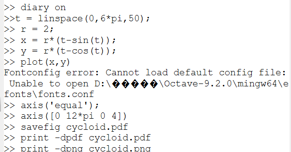{ #fig:001 width=70% }

Получаем график (рис. [-@fig:002] ) 

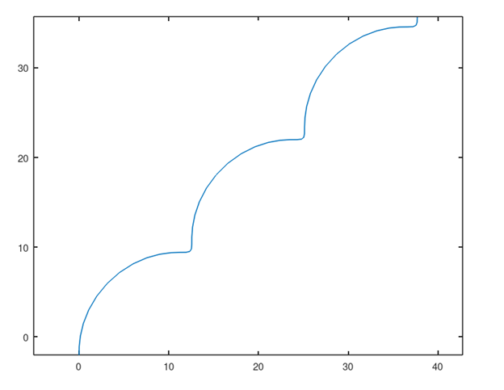{ #fig:002 width=70% }

Теперь поработаем в полярных координатах. Нарисуем график двумя способами - определим координаты по формуле перехода в полярные и через специальную функцию.  ( рис. [-@fig:003] ) 

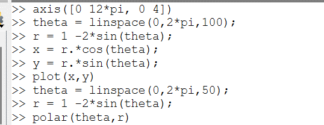{ #fig:003 width=70% }

Нарисуем получившееся ( рис. [-@fig:004] ) (рис. [-@fig:005] ) 

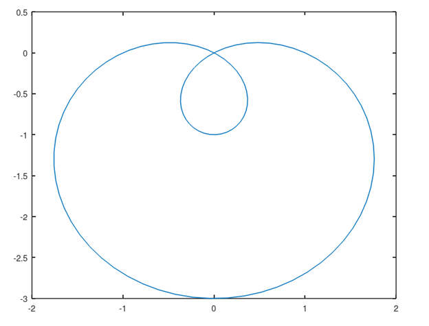{ #fig:004 width=70% }

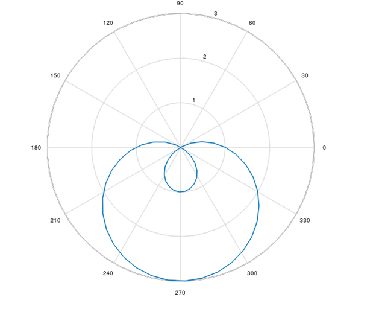{ #fig:005 width=70% }

Теперь переходим к неявным функциям. Определим функцию через лямбда-функцию ( рис. [-@fig:006] )

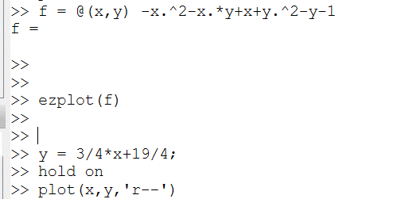{ #fig:006 width=70% }

И нарисуем получившееся (рис. [-@fig:007] )

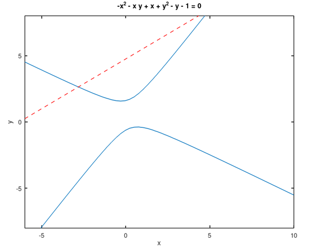{ #fig:007 width=70% }

Поработаем с комплексными числами. Попробуем произвести с ними действия, а затем нарисуем график в комплексной плоскости (рис. [-@fig:008] ) (рис. [-@fig:009] )

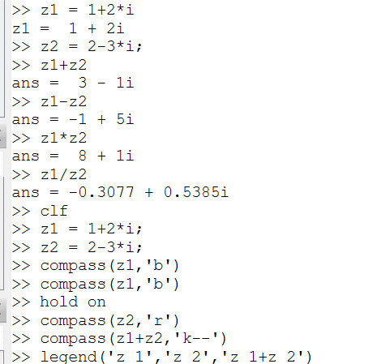{ #fig:008 width=70% }

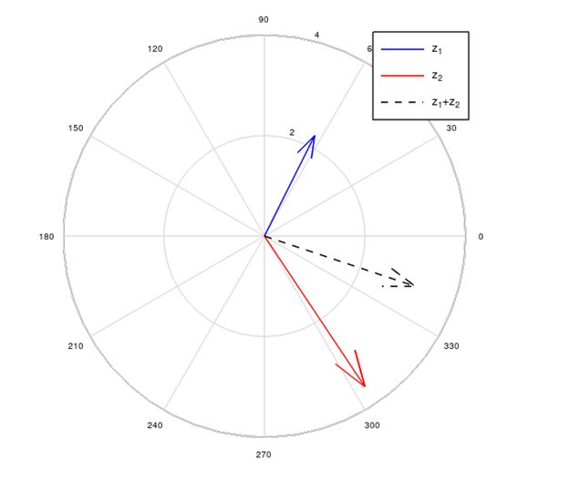{ #fig:009 width=70% }

И последний раздел - специальные функции. Здесь мы применим функцию гамма и изобразим график её и факториала.  (рис. [-@fig:010] ) (рис. [-@fig:011] )

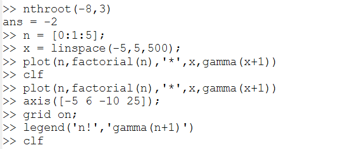{ #fig:010 width=70% }

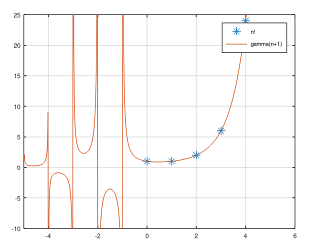{ #fig:011 width=70% }

Как можем заметить, на этом графике так же присутствуют асимптоты, которые не являются частью графика. Чтобы их убрать, разобьём область значений на интервалы. (рис. [-@fig:012] ) (рис. [-@fig:013] )

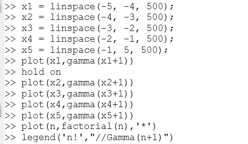{ #fig:012 width=70% }

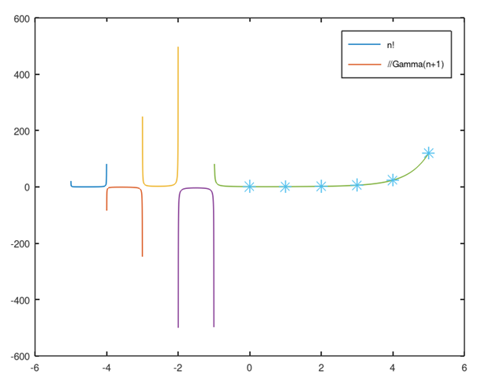{ #fig:013 width=70% }

На этом лабораторная работа закончена.

# Выводы

Познакомилась с методами работы с методами построения графиков.

# Список литературы

Лабораторная работа №7

Лабораторная работа № 7. Введение в работу с Octave [Электронный ресурс]. 2019. https://esystem.rudn.ru/pluginfile.php/2372910/mod_resource/content/2/README.pdf

