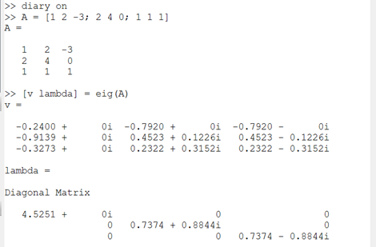
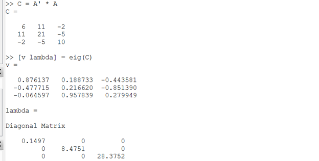
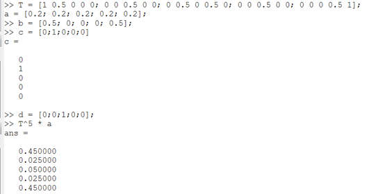
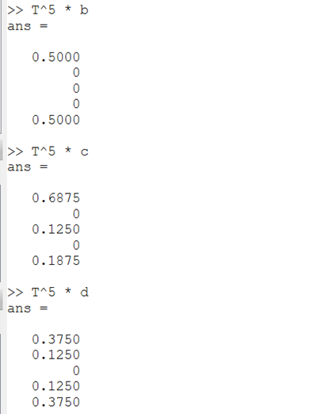
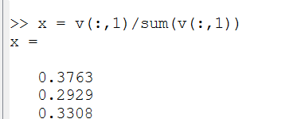
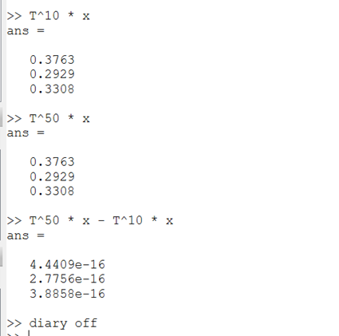

---
## Front matter
lang: ru-RU
title: Научное программирование
author: Колчева Юлия Вячеславовна
institute: РУДН, Москва, Россия

date: 7 Декабря 2024

## Formatting
toc: false
slide_level: 2
theme: metropolis
header-includes: 
 - \metroset{progressbar=frametitle,sectionpage=progressbar,numbering=fraction}
 - '\makeatletter'
 - '\beamer@ignorenonframefalse'
 - '\makeatother'
aspectratio: 43
section-titles: true
---

# Лабораторная работа 8

## Задача на собственные значения

{ #fig:001 width=70% }

## Задача на собственные значения

{ #fig:002 width=70% }

## Марковские цепи

{ #fig:003 width=70% }

## Марковские цепи

{ #fig:004 width=70% }

## Марковские цепи

{ #fig:005 width=70% }

## Марковские цепи

{ #fig:006 width=70% }

## Марковские цепи

{ #fig:007 width=70% }

## Выводы

- Изучила способы применения языка Octave.

- Познакомилась с задачей на собственные значения и марковскими цепями.

## {.standout}

Спасибо за внимание!
