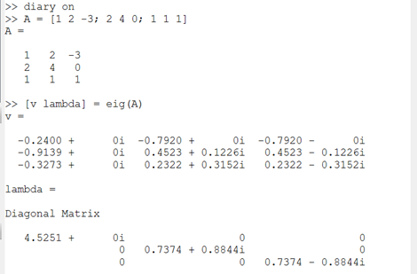
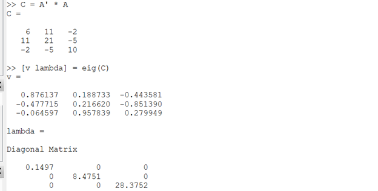
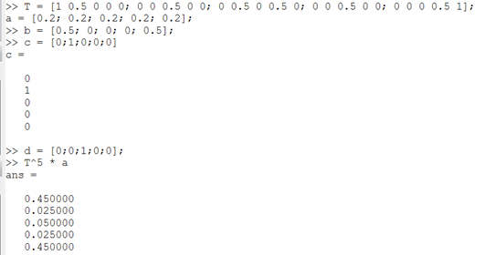
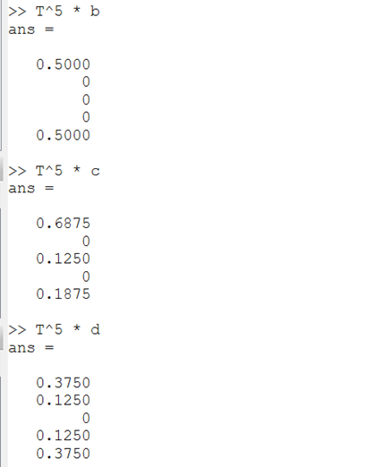
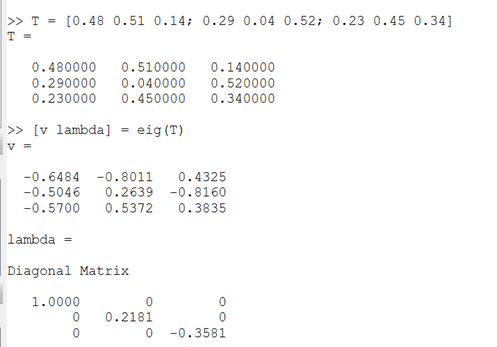
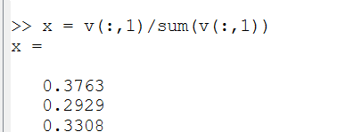
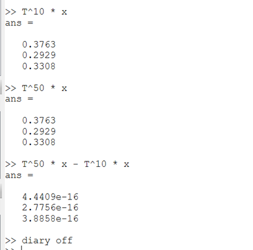

---
# Front matter
lang: ru-RU
title: "Лабораторная работа №8"
subtitle: "Научное программирование"
author: "Колчева Юлия Вячеславовна"

# Formatting
toc-title: "Содержание"
toc: true # Table of contents
toc_depth: 2
lof: true # List of figures
lot: true # List of tables
fontsize: 12pt
linestretch: 1.5
papersize: a4paper
documentclass: scrreprt
polyglossia-lang: russian
polyglossia-otherlangs: english
mainfont: PT Serif
romanfont: PT Serif
sansfont: PT Sans
monofont: PT Mono
mainfontoptions: Ligatures=TeX
romanfontoptions: Ligatures=TeX
sansfontoptions: Ligatures=TeX,Scale=MatchLowercase
monofontoptions: Scale=MatchLowercase
indent: true
pdf-engine: lualatex
header-includes:
  - \linepenalty=10 # the penalty added to the badness of each line within a paragraph (no associated penalty node) Increasing the value makes tex try to have fewer lines in the paragraph.
  - \interlinepenalty=0 # value of the penalty (node) added after each line of a paragraph.
  - \hyphenpenalty=50 # the penalty for line breaking at an automatically inserted hyphen
  - \exhyphenpenalty=50 # the penalty for line breaking at an explicit hyphen
  - \binoppenalty=700 # the penalty for breaking a line at a binary operator
  - \relpenalty=500 # the penalty for breaking a line at a relation
  - \clubpenalty=150 # extra penalty for breaking after first line of a paragraph
  - \widowpenalty=150 # extra penalty for breaking before last line of a paragraph
  - \displaywidowpenalty=50 # extra penalty for breaking before last line before a display math
  - \brokenpenalty=100 # extra penalty for page breaking after a hyphenated line
  - \predisplaypenalty=10000 # penalty for breaking before a display
  - \postdisplaypenalty=0 # penalty for breaking after a display
  - \floatingpenalty = 20000 # penalty for splitting an insertion (can only be split footnote in standard LaTeX)
  - \raggedbottom # or \flushbottom
  - \usepackage{float} # keep figures where there are in the text
  - \floatplacement{figure}{H} # keep figures where there are in the text
---

# Цель работы

Изучение языка Octave, знакомство с задачей на собственные значения и марковскими цепями. 

# Задание

 Разобраться со спецификой языка и выполнить операции. 

1. Собственные значения и собственные векторы
2. Марковские цепи

# Выполнение лабораторной работы

 Для начала работы с программой включим журналирование сессии командой diary on. Найдём собственные векторы матрицы А с помощью функции eig ( рис. [-@fig:001] )

{ #fig:001 width=70% }

Теперь попробуем получить матрицу с действительными значениями. Для этого посчитаем матрицу С и найдём её вектора(рис. [-@fig:002] ) 

{ #fig:002 width=70% }

Теперь перейдём к теме марковских цепей. Посторожим таблицу переходов Т и вектора вероятности переходов. Вычислим вероятности переходов через 5 шагов. Для этого нужно возвести матрицу Т в 5 степень и умножить на вектор ( рис. [-@fig:003] )  ( рис. [-@fig:004] )

{ #fig:003 width=70% }

{ #fig:004 width=70% }

Теперь найдём вектор равновесного состояния х. Для этого найдём собственные значения матрицы(рис. [-@fig:005] ) 

{ #fig:005 width=70% }

И применим формулу ( рис. [-@fig:006] )

{ #fig:006 width=70% }

Проверим, является ли получившийся вектор равновесным (рис. [-@fig:007] )

{ #fig:007 width=70% }

Как видим, разница между состояниями минимальна, а значит наши вычисления правильны.

На этом лабораторная работа закончена.

# Выводы

Познакомилась с задачей на собственные значения и марковскими цепями.

# Список литературы

Лабораторная работа №8

Лабораторная работа № 8. Введение в работу с Octave [Электронный ресурс]. 2019. https://esystem.rudn.ru/pluginfile.php/2372912/mod_resource/content/2/README.pdf

